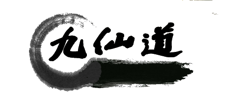

<div align="center">

</div>

<p align="center">
  
</p>

> [!WARNING]
> 此项目仍在开发阶段，如果遇到问题请发送 Issue
>
> 也欢迎各路大佬提交pr参与开发

# 九仙道重构版

上古鸿蒙未分，天地混沌。待到道化万物，炎黄现世，世人便已有追求天道之意。而后，袭明自然，道法天地，修仙之辈皆以己心明悟修道之法。待到日后上古九神君修为大成，修仙界更是步入一大盛世。然则无论人妖，纵使已初悟天道，亦难逃邪念惑心。于是人，鬼，妖，魔四族互相倾轧，以致各方元气大伤，从此修仙界便入沉寂。但如今，各方之斗又现端倪。且灵兽谷之诞生，又为此番争斗增添了几分难料之意。此番风起云涌之际，怎可料是否会有新的大能续写传奇……

# 历史

九仙道始于 2016年，22年停止更新

# 使用

本项目使用taro进行编写，使用前需了解taro相关知识

1. 安装依赖

```sh
pnpm i # 安装依赖
```

2. 启动服务

```sh
pnpm dev
```

# 构建

```sh
pnpm build
```

[安卓端项目工程](https://github.com/xiaoxustudio/taro-jiuxiandao-android)

# 进度

- [x] 主界面
- [x] 创建角色界面
- [x] 主界面
- [x] 主界面属性显示
- [x] 试炼
- [ ] 试炼功能（还需修复，进度60%）
- [ ] 炼丹
- [ ] 炼丹功能
- [ ] 炼器
- [ ] 炼器功能
- [x] 法宝
- [x] 法宝功能
- [ ] 动态功能
- [x] 坊市
- [x] 坊市功能（只写了购买法宝部分）
- [x] 储物（只写了法宝部分）
- [ ] 储物功能
- [ ] 灵兽
- [ ] 灵兽功能
- [ ] 门派
- [ ] 门派功能
- [ ] 药园
- [ ] 药园功能
- [ ] 洞府
- [ ] 洞府功能
- [ ] 成就
- [ ] 成就功能
- [ ] 赌场
- [ ] 赌场功能
- [x] 角色功能（可正常显示角色，其他待定测试）
- [ ] 社区功能
- [ ] CDK功能
- [x] 签到
      ...待定

# 贡献

参照 [CONTRIBUTING](./CONTRIBUTING.md) 进行

# 关于

此项目由徐然（原团队成员小徐）进行重构。

作者：[徐然](https://github.com/xiaoxustudio)

联系方式：[xugame@qq.com](emailto://xugame@qq.com)

欢迎提出您宝贵的 **issue**，我们将会处理。

# LICENSE

[MIT](LICENSE) And 以下条款

在MIT协议的基础上，我们外加一个条款（此条款高于MIT，如有冲突以该条款为准）：**您在使用九仙道重构版项目的基础上可随意修改，但需要在关于名单，或其他致谢等地方增加一处醒目的本项目链接或文字来表明您的项目是基于本项目修改的即可**
